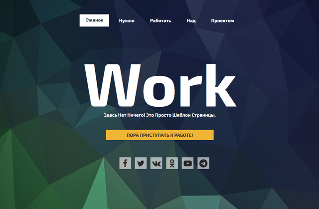

# Шаблон для автоматизированной WEB-разработки

``` Version 2.0.1 ```

## Начало работы с шаблоном

При автоматизированной frontend-разработке используются такие инструменты, как `node.js`, `npm`, `gulp`, `sass`-препроцессор и ряд плагинов для него.

Для начала использования шаблона, создайте папку проекта и склонируйте в него текущий репозиторий командой в консоли:

    git clone https://github.com/DigitalChip/WEBstartTemplate.git ./ 

Или скачайте zip-архив этого шаблона и распакуйте его в папку проекта.

Если у вас уже установлены `node.js`, `npm` и глобально `gulp-cli`, то просто запустите файл ``start_init.cmd``, который находится в корне папки проекта. В нем последовательно вызываются команды на установку необходимых пакетов и зависимостей.

После некоторого времени ожидания и загрузки пакетов, автоматически выполнится команда `gulp`, которая запустит препроцессор sass, отслеживание измененния файлов и локальный сервер для разработки и live-reload.

Все. Открывайте браузер, переходите по адресу [http://localhost:8080](http://localhost:8080), открывайте любимый редактор кода и правьте нужные файлы: index.html, *.sass, *.js...

При сохранении этих файлов будет автоматически вызываться пересборка измененных частей проекта и перезагрузка страницы в браузере (Live-reload), и вы сразу будете видеть изменения.



## Работа над шаблоном
Шаблон для автоматизированной разработки был разработан в процессе изучения программирования и разработки web-проектов, когда надоело работать по-старинке, переписывая кучу кода и тратя много времени на допиливание под проект. 

В процессе поисков решения проблем набрел на [интересное видео](https://www.youtube.com/watch?v=lOXz0ZYuTqI&t=12s&gl=RU&hl=ru ) на канале WebDesign Master. Идеи, изложенные в видео, как говорится, зашли, и началось изучение предложенных инструментов и перепиливание предложенного шаблона под себя. Тогда у автора это была первая или вторая версия шаблона (шаблон optimizedHTML).

В первой версии моего шаблона применялись `Gulp` 3-й версии, пакетный менеджер `Bower`, набор миксинов (микшенов) `Boubon`. Работало потихоньку более-менее нормально. Пилил на этом шаблоне несколько проектов.

Но пришло время. Обновились инструменты, соответственно, пора бы обновить и шаблон.

Шаблон хотелось сделать как можно более универсальным. В процессе "чтения интернетов" и собственных умозаключений, пришел к такому виду файла описания задач (gulpfile.js), как представлено.

## Ограничения
Пока незамечено. Тестируем...
